# BrainCo Robot Description Assets

This repository contains public robot description assets for BrainCo robot hands, arms, and combined arm-hand systems. The package is intended for simulation, visualization, integration testing, and downstream robotics research.

The public release includes URDF, MJCF, and USD descriptions, together with the mesh assets they reference.

## What Is Included

| System | Description | Formats |
| --- | --- | --- |
| `revo2_system` | Revo2 left and right dexterous hands | URDF, MJCF, USD |
| `revo3_system` | Revo3 left and right dexterous hands | URDF, MJCF, USD |
| `revoarm_system` | Single-arm and bimanual RevoArm assemblies with Revo2/Revo3 hands | URDF, MJCF, USD |
| `revotron_system` | Single-arm and bimanual RevoTron platform assemblies with Revo3 hands | URDF, MJCF, USD |

## Visual Catalog

The rendered previews below correspond to the robot description entry points in this repository. `Arm: None` means the model is a standalone dexterous hand with no arm assembly.

### Standalone Hands

| Preview | Description files | Arm | Hand | Configuration | Side |
| --- | --- | --- | --- | --- | --- |
| 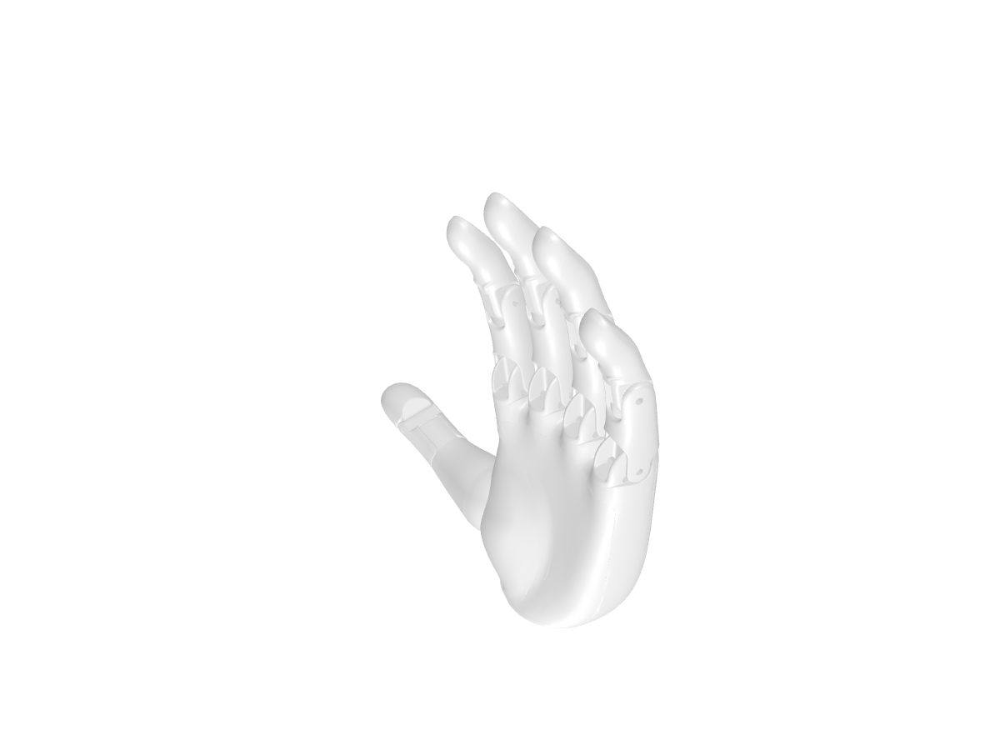 | URDF: `revo2_system/urdf/revo2_left.urdf`<br>MJCF: `revo2_system/mjcf/revo2_left.xml`<br>USD: `revo2_system/usd/revo2_left.usd` | None | Revo2 | Single hand | Left |
| 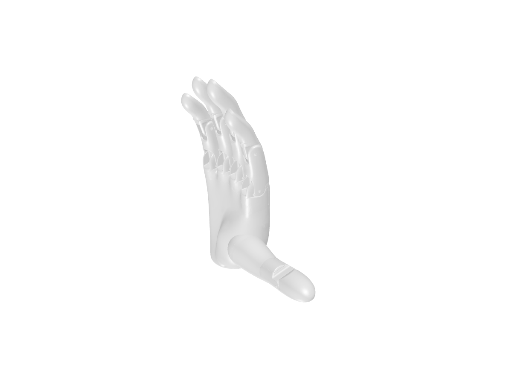 | URDF: `revo2_system/urdf/revo2_right.urdf`<br>MJCF: `revo2_system/mjcf/revo2_right.xml`<br>USD: `revo2_system/usd/revo2_right.usd` | None | Revo2 | Single hand | Right |
| 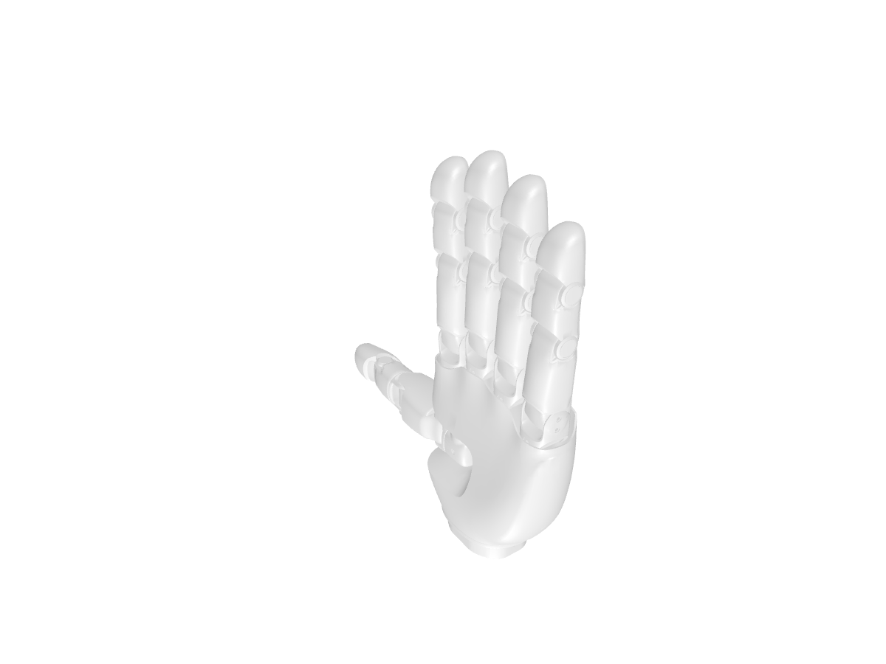 | URDF: `revo3_system/urdf/revo3_left.urdf`<br>MJCF: `revo3_system/mjcf/revo3_left.xml`<br>USD: `revo3_system/usd/revo3_left.usd` | None | Revo3 | Single hand | Left |
| 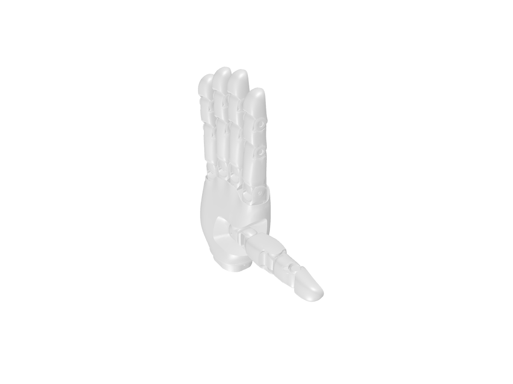 | URDF: `revo3_system/urdf/revo3_right.urdf`<br>MJCF: `revo3_system/mjcf/revo3_right.xml`<br>USD: `revo3_system/usd/revo3_right.usd` | None | Revo3 | Single hand | Right |

### RevoArm Assemblies

| Preview | Description files | Arm | Hand | Configuration | Side |
| --- | --- | --- | --- | --- | --- |
| 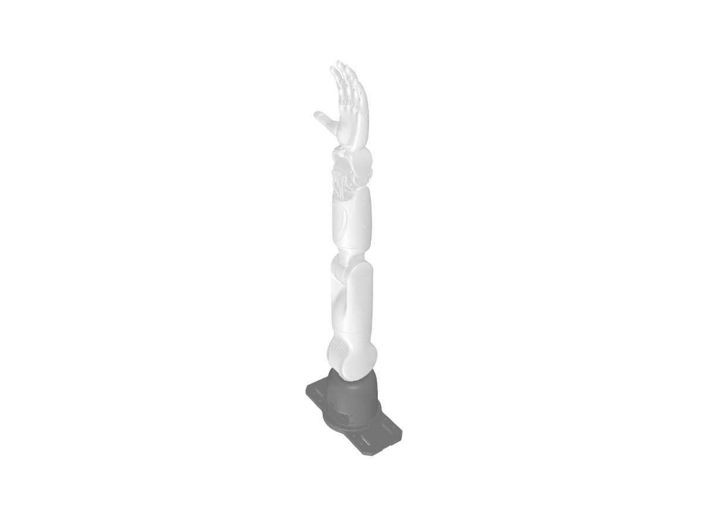 | URDF: `revoarm_system/urdf/revoarm_single_left_revo2.urdf`<br>MJCF: `revoarm_system/mjcf/revoarm_single_left_revo2.xml`<br>USD: `revoarm_system/usd/revoarm_single_left_revo2.usd` | RevoArm | Revo2 | Single arm | Left |
| 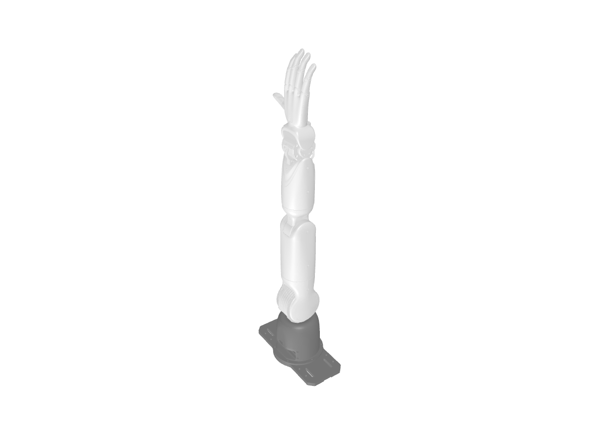 | URDF: `revoarm_system/urdf/revoarm_single_right_revo2.urdf`<br>MJCF: `revoarm_system/mjcf/revoarm_single_right_revo2.xml`<br>USD: `revoarm_system/usd/revoarm_single_right_revo2.usd` | RevoArm | Revo2 | Single arm | Right |
| 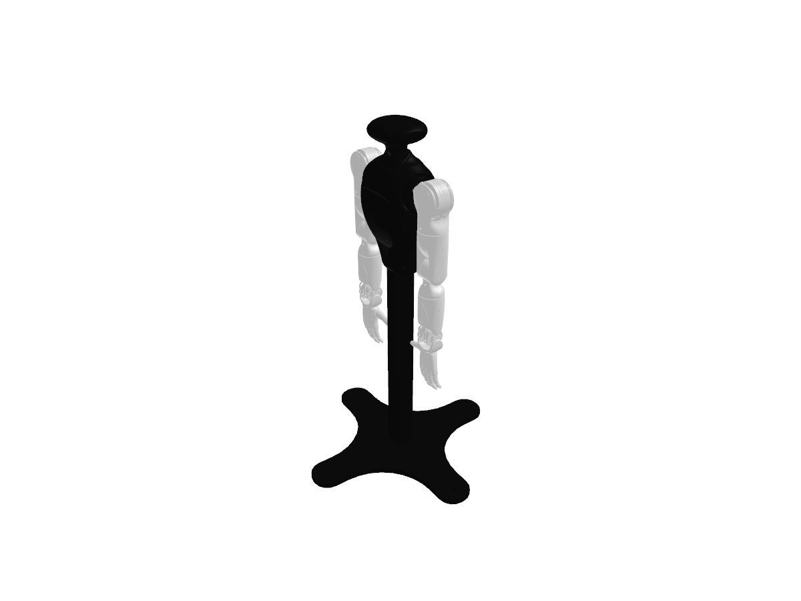 | URDF: `revoarm_system/urdf/revoarm_bimanual_revo2.urdf`<br>MJCF: `revoarm_system/mjcf/revoarm_bimanual_revo2.xml`<br>USD: `revoarm_system/usd/revoarm_bimanual_revo2.usd` | RevoArm | Revo2 | Bimanual | Left + right |
| 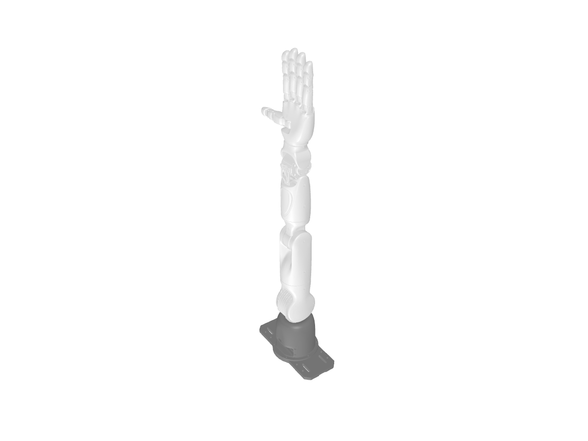 | URDF: `revoarm_system/urdf/revoarm_single_left_revo3.urdf`<br>MJCF: `revoarm_system/mjcf/revoarm_single_left_revo3.xml`<br>USD: `revoarm_system/usd/revoarm_single_left_revo3.usd` | RevoArm | Revo3 | Single arm | Left |
| 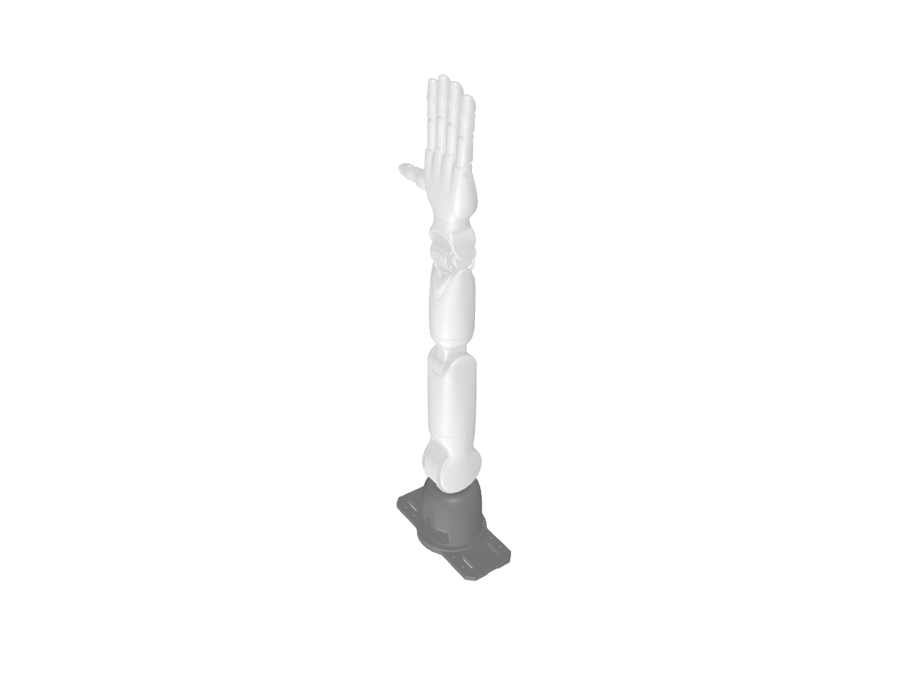 | URDF: `revoarm_system/urdf/revoarm_single_right_revo3.urdf`<br>MJCF: `revoarm_system/mjcf/revoarm_single_right_revo3.xml`<br>USD: `revoarm_system/usd/revoarm_single_right_revo3.usd` | RevoArm | Revo3 | Single arm | Right |
| 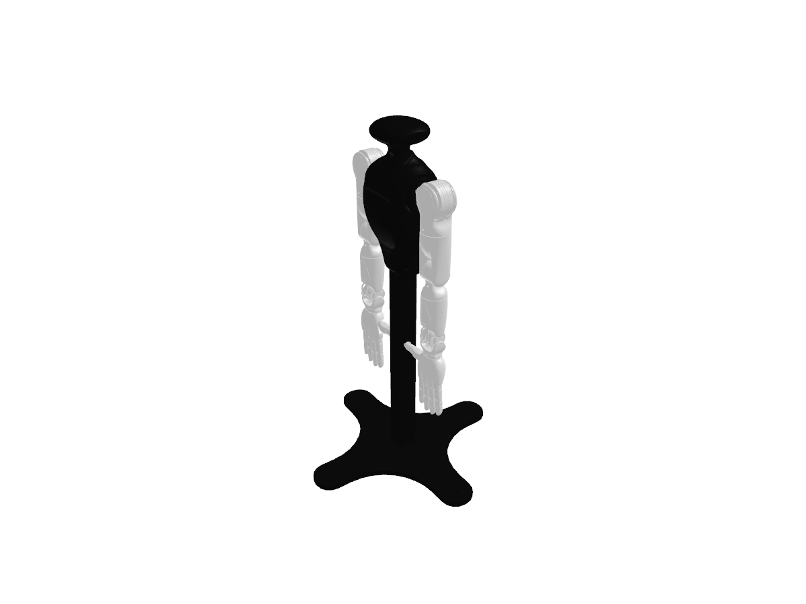 | URDF: `revoarm_system/urdf/revoarm_bimanual_revo3.urdf`<br>MJCF: `revoarm_system/mjcf/revoarm_bimanual_revo3.xml`<br>USD: `revoarm_system/usd/revoarm_bimanual_revo3.usd` | RevoArm | Revo3 | Bimanual | Left + right |

### RevoTron Assemblies

| Preview | Description files | Arm | Hand | Configuration | Side |
| --- | --- | --- | --- | --- | --- |
| 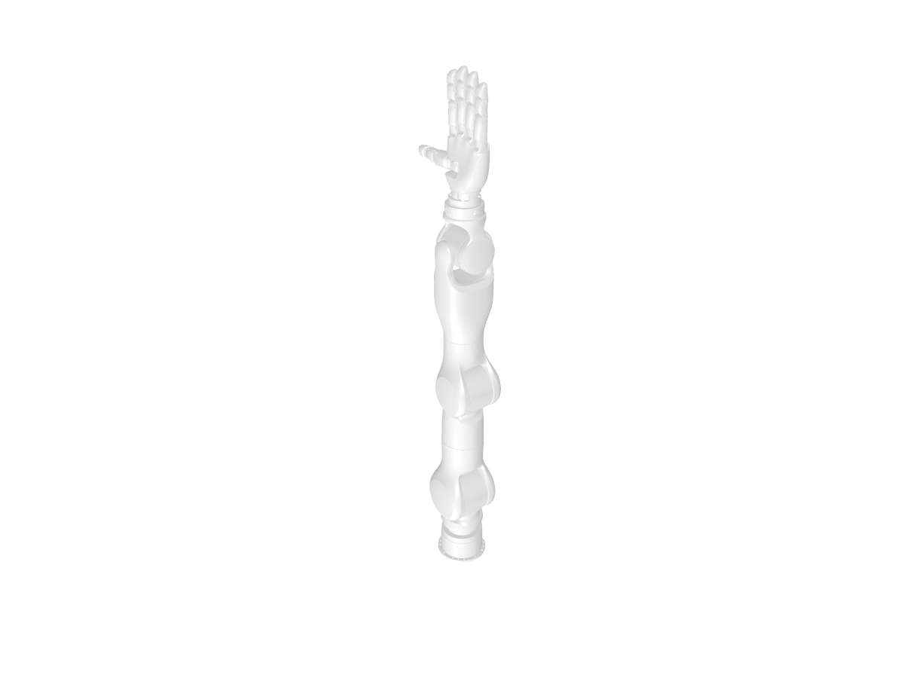 | URDF: `revotron_system/urdf/revotron_single_left_revo3.urdf`<br>MJCF: `revotron_system/mjcf/revotron_single_left_revo3.xml`<br>USD: `revotron_system/usd/revotron_single_left_revo3.usd` | RevoTron | Revo3 | Single arm | Left |
| 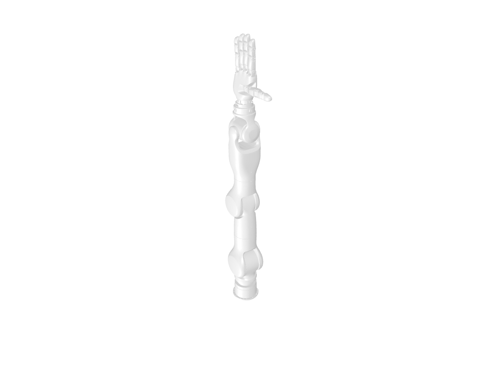 | URDF: `revotron_system/urdf/revotron_single_right_revo3.urdf`<br>MJCF: `revotron_system/mjcf/revotron_single_right_revo3.xml`<br>USD: `revotron_system/usd/revotron_single_right_revo3.usd` | RevoTron | Revo3 | Single arm | Right |
| 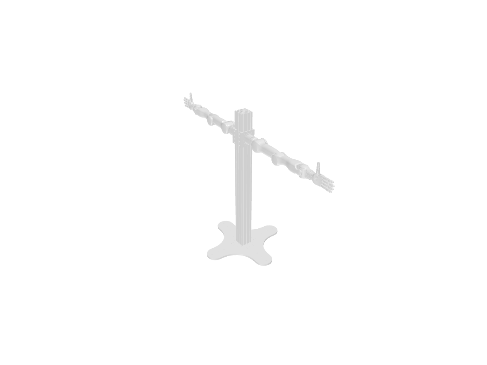 | URDF: `revotron_system/urdf/revotron_bimanual_revo3.urdf`<br>MJCF: `revotron_system/mjcf/revotron_bimanual_revo3.xml`<br>USD: `revotron_system/usd/revotron_bimanual_revo3.usd` | RevoTron | Revo3 | Bimanual | Left + right |

## Using the Models

URDF files can be loaded by common robotics tools such as ROS, RViz, Pinocchio, and other URDF-compatible parsers.

MJCF files can be loaded directly with MuJoCo:

```python
import mujoco

model = mujoco.MjModel.from_xml_path(
    "revoarm_system/mjcf/revoarm_bimanual_revo3.xml"
)
data = mujoco.MjData(model)
```

USD files can be opened with USD-compatible tools such as `usdview` or loaded in NVIDIA Isaac Sim / Isaac Lab:

```bash
usdview revo3_system/usd/revo3_left.usd
```

The top-level USD files, such as `revo3_system/usd/revo3_left.usd`, are the recommended entry points. The `usd/configuration/` files are implementation layers used by the entry point to compose base geometry, physics properties, robot metadata, and optional sensor layers.

Mesh paths are stored as relative paths, so load models from the repository root or preserve the directory layout when copying files into another project.

## Notes For Simulation

- MJCF files separate visual and collision geometry where applicable. Visual geoms are intended for rendering, while collision geoms are intended for contact simulation.
- USD files include the converted robot hierarchy, visual and collision geometry, PhysX articulation metadata, and Isaac robot/link/joint metadata where applicable.
- The models are provided as description assets. Controller gains, task-space policies, calibration data, and application-specific simulation settings are intentionally left to downstream projects.

## Work In Progress

The public asset set is still evolving. Planned or ongoing work includes:

- MJCF actuator definitions and control-ready simulation settings.
- Additional validation across common robotics and simulation toolchains.

## License

License information will be provided with the public release. Please review the accompanying license before redistributing or modifying these assets.
